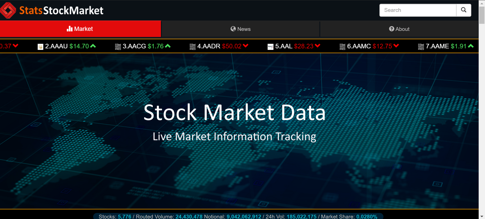
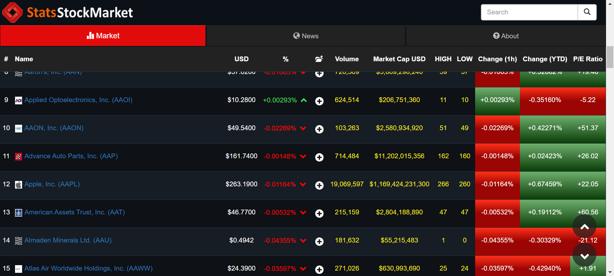
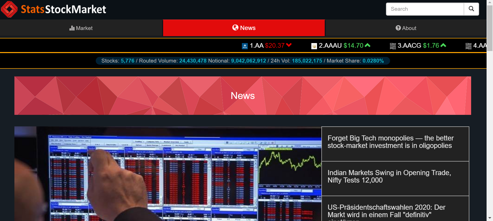
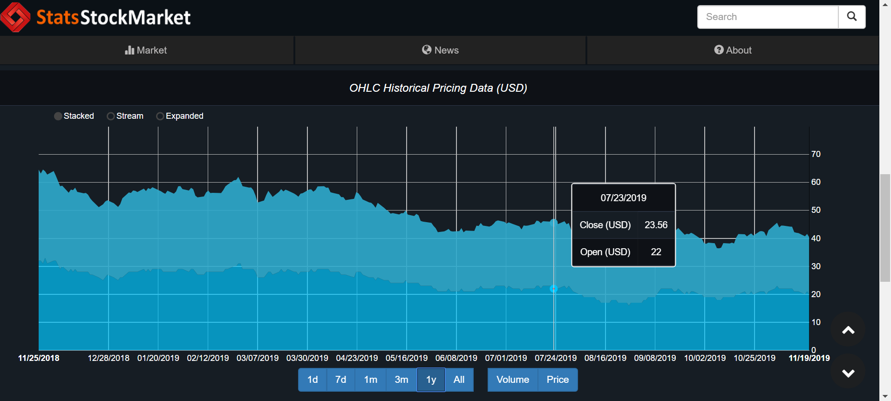
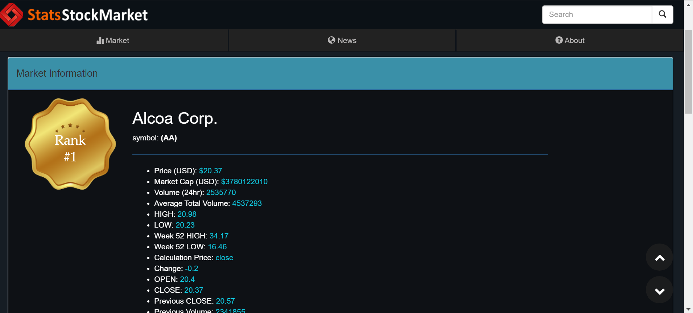
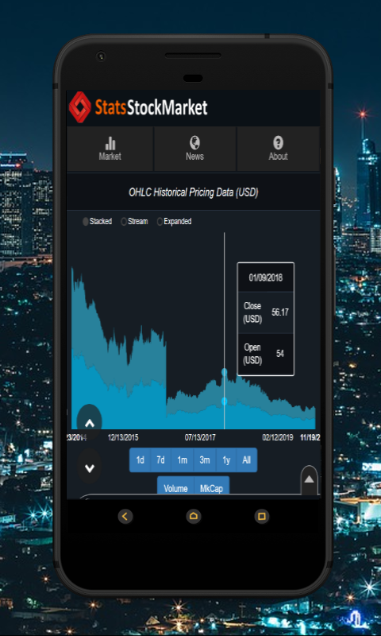
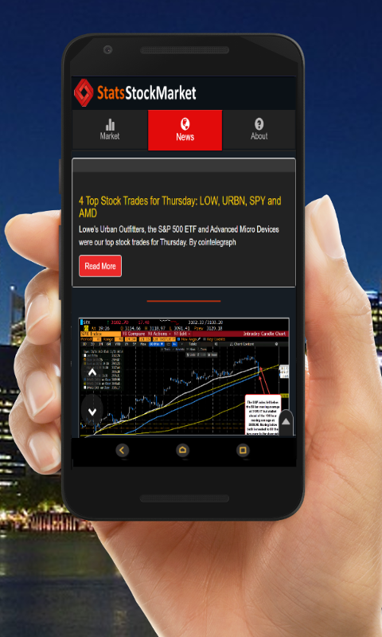
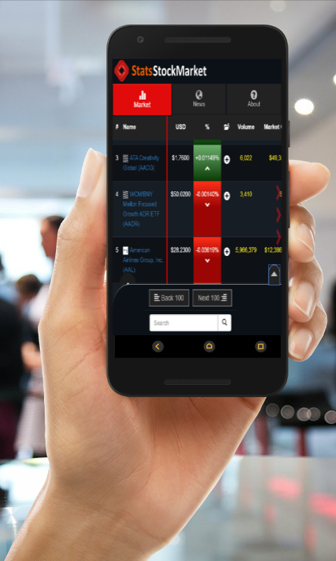

# Stock_Market_Stats_Web_Application_Tracker

This is an old project, and it is no longer being updated or worked on. 

# Brief Summary

A Stock market tracker with the tracking and data compiled of over 1000 stocks.  Users are able to view market data, prices, charts, rankings, and more on any device browser, with active tracking of stock information. An application interacting with the web application was also created for android. 

# Updating Data and Cron Jobs
There are seperate micro-tasks run at certain intervals to update all the data from the site. These micro-tasks are under the cron folder and should be run as an automated cron job.

Here are the intervals at which the script commands should run as a cron job:

- every 15mins     =>   */15	*	*	*	*  => wget -O - -q https://website.com/cron/updatedat.php >/dev/null 2>&1 
- once a day 12am  =>     0       0       *       *       *  => wget -O - -q https://website.com/cron/updatenews.php >/dev/null 2>&1
- once a day 11pm   =>     0      23       *       *       *  =>  wget -O - -q https://website.com/cron/gethistoricdat.php >/dev/null 2>&1
- once a day 12am   =>     0       0       *       *       *  =>  wget -O - -q https://website.com/cron/getallstocksymbols.php >/dev/null 2>&1

# Historical Data
The updatehistoricdata.php cron job takes the current data stored, and updates the historic data on the site. Historical data is from iEx Trading Group but not all of it is included in this repo due to its large size. The historical data can be retrieved using the gethistoricdat.php script, it grabs the scraped historical data from iExTrading for all stocks. The historical data for certain stocks has been included to show how the data is graphed in the information page.

# Mobile Application
The website is cross-platform, it works on both the browser, and as a standalone app that loads the website on a webview. The site also scales based on viewport to support multiple screen sizes.

    
    
    
    

# Data Source API
iExtrading's api and terms of service may update after the date this project was uploaded. When using this code you will have to update accordingly to fit the guidelines.
- https://iexcloud.io/docs/api/

# API Request Limits
The IEX Cloud API is based on REST, has resource-oriented URLs, returns JSON-encoded responses, and returns standard HTTP response codes.

IEX Cloud only applies request limits per IP address to ensure system stability. We limit requests to 100 per second per IP measured in milliseconds, so no more than 1 request per 10 milliseconds. We do allow bursts, but this should be sufficient for almost all use cases.

SSE endpoints are limited to 50 symbols per connection. You can make multiple connections if you need to consume more than 50 symbols.
